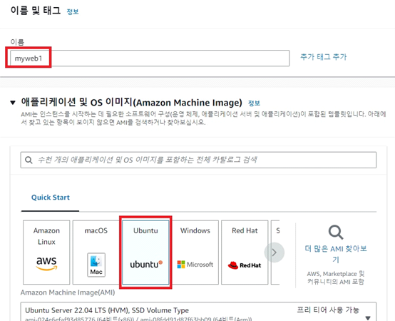
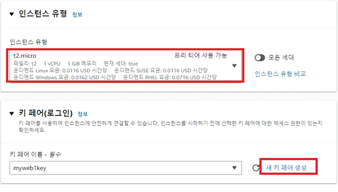
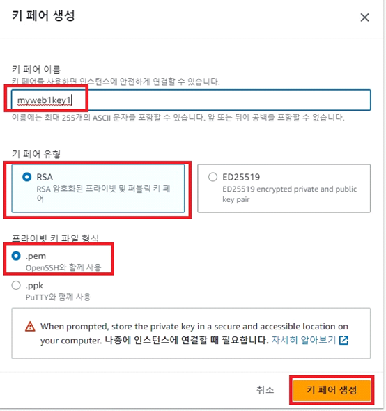
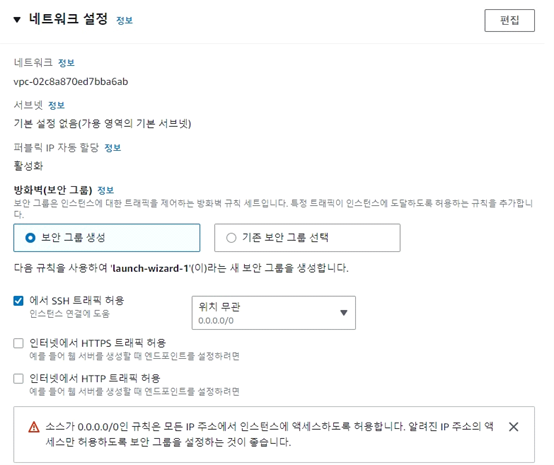
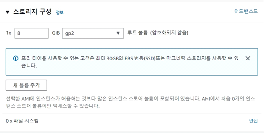
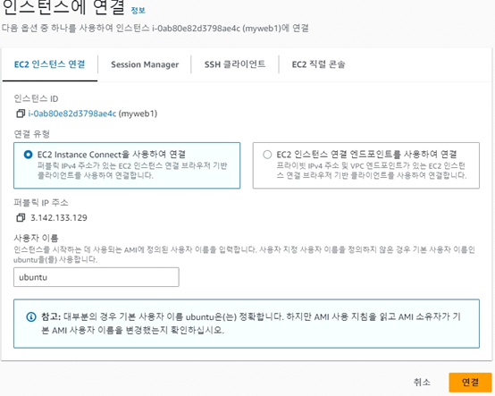

# AWS_Study
<div>
 <h1>인스턴스 생성순서</h1><br>
<p>인스턴스 생성시 지역이 아시아/서울인지 꼭 확인한다</p><br>
<h3>1</h3>
  

<h3>2</h3>
  

<h3>3</h3>
  

<h3>4</h3>
  

<h3>5</h3>
  

<h3>6</h3>
  


  

<hr><br>

<hr>
# AWS 인스턴스 설정과 Oracle Database 설치

## 보안 그룹 설정

- 생성한 인스턴스의 왼쪽 네트워크 및 보안 메뉴에서 보안 그룹을 선택하고 인바운드 규칙 편집 버튼을 클릭합니다.
- 다음 두 개의 규칙을 추가합니다:
  - 포트 8080, 모든 IP 주소 허용
  - 포트 8081, 모든 IP 주소 허용

## 인스턴스 연결

- SSH 또는 파일질라를 사용하여 생성한 인스턴스에 연결합니다.

## WAR 파일 생성

- 이클립스 프로젝트에서 우클릭하여 "Run As" > "Maven Build"를 선택하고, Goals에 `package`를 입력합니다.
- 프로젝트의 target 폴더에 생성된 WAR 파일을 확인합니다.

## 파일질라를 사용하여 WAR 파일 업로드

- 파일질라 프로그램을 열고, SFTP 프로토콜을 선택합니다.
- 호스트는 AWS 인스턴스 주소, 포트는 22, 사용자는 ubuntu로 설정합니다.
- 인스턴스 생성시 다운받은 키파일(~.pem)을 선택하여 연결합니다.
- 생성한 WAR 파일을 업로드합니다.

## 인스턴스에서 실행

- 생성한 인스턴스에 SSH로 접속합니다.
- Java 17을 설치하고, WAR 파일을 실행합니다.
  ```bash
  sudo apt update
  sudo apt install openjdk-17-jdk
  java -jar spring_aws1-0.0.1-SNAPSHOT.war

  # Oracle Database 설치

## Oracle Database 다운로드

- Oracle Database 11g를 [Oracle 웹사이트](https://www.oracle.com/database/technologies/xe-prior-release-downloads.html)에서 다운로드합니다.

## 필요한 패키지 설치

```bash
sudo apt install zip
unzip oracle-xe-11.2.0-1.0.x86_64.rpm.zip

#Swap 파일 설정
free -m
sudo dd if=/dev/zero of=/swapfile bs=1M count=1024
sudo mkswap /swapfile
sudo swapon -v /swapfile
free -m
sudo vi /etc/fstab
# 다음 내용을 추가
/swapfile       swap    swap defaults   0       0

#oracle database 설치
sudo apt -y install alien libaio1 unixodbc
cd Disk1
sudo alien --scripts -d oracle*
sudo dpkg --install oracle*.deb
sudo /etc/init.d/oracle-xe configure
Oracle Database 11g Express Edition Configuration
-------------------------------------------------
This will configure on-boot properties of Oracle Database 11g Express Edition.
The following questions will determine whether the database should be starting upon system boot, the ports it will use, and the passwords that will be used for database accounts.
Press <Enter> to accept the defaults. Ctrl-C will abort.

Specify the HTTP port that will be used for Oracle Application Express [8080]:8000

Specify a port that will be used for the database listener [1521]:1521

Specify a password to be used for database accounts.
Note that the same password will be used for SYS and SYSTEM.
Oracle recommends the use of different passwords for each database account. 
This can be done after initial configuration: [system_password 입력]

Do you want Oracle Database 11g Express Edition to be started on boot (y/n) [y]:y

sudo vi ~/.bashrc

#다음내용 추가
export ORACLE_HOME=/u01/app/oracle/product/11.2.0/xe 
export ORACLE_SID=XE 
export NLS_LANG=`$ORACLE_HOME/bin/nls_lang.sh` 
export ORACLE_BASE=/u01/app/oracle
export LD_LIBRARY_PATH=$ORACLE_HOME/lib:$LD_LIBRARY_PATH 
export PATH=$ORACLE_HOME/bin:$PATH

source ~/.bashrc

#Oracle Database에 접속하여 계정 설정
sqlplus
Enter user-name: system
Enter password: [system_password 입력]
alter user hr identified by hr account unlock;
alter database set time_zone='Asia/Seoul';
disconn;
conn hr/hr;
#테이블 목록 확인
select table_name from tabs;


## Oracle Database 타임존 설정

- Oracle Database의 타임존을 설정합니다.

```bash
vi ~/.bashrc
#다음 내용 추가
export TZ=Asia/Seoul
#변경 사항 적용
source ~/.bashrc

#다시 restapi 프로젝트 실행해보기
java -jar spring_restapi_shop-0.0.1-SNAPSHOT.war


  
</div>
